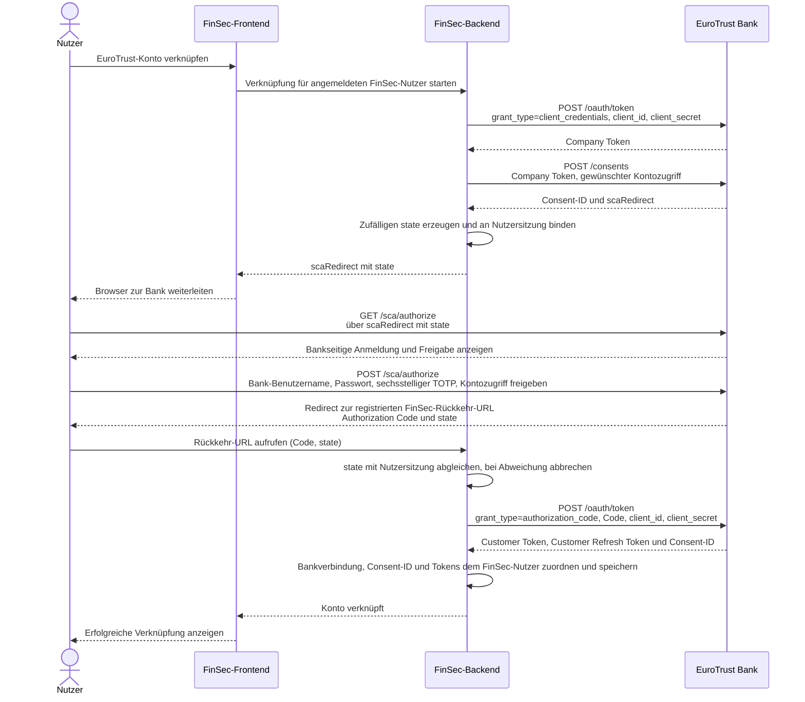

# 2.3 Sequenzdiagramm – Bankkonto verknüpfen

```mermaid
sequenceDiagram
    actor U as Nutzer
    participant F as FinSec-Frontend
    participant B as FinSec-Backend
    participant E as EuroTrust Bank

    U->>F: EuroTrust-Konto verknüpfen
    F->>B: Verknüpfung für angemeldeten FinSec-Nutzer starten
    B->>E: POST /oauth/token<br/>grant_type=client_credentials, client_id, client_secret
    E-->>B: Company Token
    B->>E: POST /consents<br/>Company Token, gewünschter Kontozugriff
    E-->>B: Consent-ID und scaRedirect
    B->>B: Zufälligen state erzeugen und an Nutzersitzung binden
    B-->>F: scaRedirect mit state
    F-->>U: Browser zur Bank weiterleiten
    U->>E: GET /sca/authorize<br/>über scaRedirect mit state
    E-->>U: Bankseitige Anmeldung und Freigabe anzeigen
    U->>E: POST /sca/authorize<br/>Bank-Benutzername, Passwort, sechsstelliger TOTP, Kontozugriff freigeben
    E-->>U: Redirect zur registrierten FinSec-Rückkehr-URL<br/>Authorization Code und state
    U->>B: Rückkehr-URL aufrufen (Code, state)
    B->>B: state mit Nutzersitzung abgleichen, bei Abweichung abbrechen
    B->>E: POST /oauth/token<br/>grant_type=authorization_code, Code, client_id, client_secret
    E-->>B: Customer Token, Customer Refresh Token und Consent-ID
    B->>B: Bankverbindung, Consent-ID und Tokens dem FinSec-Nutzer zuordnen und speichern
    B-->>F: Konto verknüpft
    F-->>U: Erfolgreiche Verknüpfung anzeigen
```
