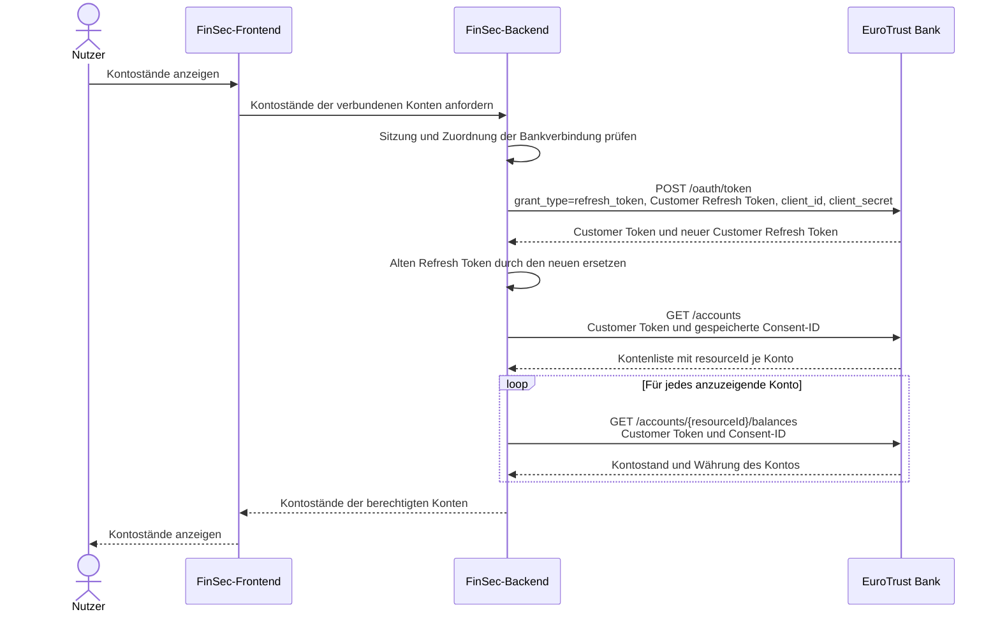

# 2.3 Sequenzdiagramm – Kontostände lesen

```mermaid
sequenceDiagram
    actor U as Nutzer
    participant F as FinSec-Frontend
    participant B as FinSec-Backend
    participant E as EuroTrust Bank

    U->>F: Kontostände anzeigen
    F->>B: Kontostände der verbundenen Konten anfordern
    B->>B: Sitzung und Zuordnung der Bankverbindung prüfen
    B->>E: POST /oauth/token<br/>grant_type=refresh_token, Customer Refresh Token, client_id, client_secret
    E-->>B: Customer Token und neuer Customer Refresh Token
    B->>B: Alten Refresh Token durch den neuen ersetzen
    B->>E: GET /accounts<br/>Customer Token und gespeicherte Consent-ID
    E-->>B: Kontenliste mit resourceId je Konto
    loop Für jedes anzuzeigende Konto
        B->>E: GET /accounts/{resourceId}/balances<br/>Customer Token und Consent-ID
        E-->>B: Kontostand und Währung des Kontos
    end
    B-->>F: Kontostände der berechtigten Konten
    F-->>U: Kontostände anzeigen
```

