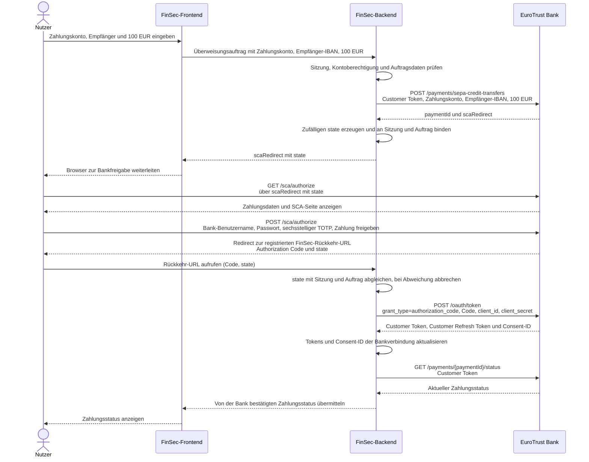

# 2.3 Sequenzdiagramm – 100 € überweisen

```mermaid
sequenceDiagram
    actor U as Nutzer
    participant F as FinSec-Frontend
    participant B as FinSec-Backend
    participant E as EuroTrust Bank

    U->>F: Zahlungskonto, Empfänger und 100 EUR eingeben
    F->>B: Überweisungsauftrag mit Zahlungskonto, Empfänger-IBAN, 100 EUR
    B->>B: Sitzung, Kontoberechtigung und Auftragsdaten prüfen
    B->>E: POST /payments/sepa-credit-transfers<br/>Customer Token, Zahlungskonto, Empfänger-IBAN, 100 EUR
    E-->>B: paymentId und scaRedirect
    B->>B: Zufälligen state erzeugen und an Sitzung und Auftrag binden
    B-->>F: scaRedirect mit state
    F-->>U: Browser zur Bankfreigabe weiterleiten
    U->>E: GET /sca/authorize<br/>über scaRedirect mit state
    E-->>U: Zahlungsdaten und SCA-Seite anzeigen
    U->>E: POST /sca/authorize<br/>Bank-Benutzername, Passwort, sechsstelliger TOTP, Zahlung freigeben
    E-->>U: Redirect zur registrierten FinSec-Rückkehr-URL<br/>Authorization Code und state
    U->>B: Rückkehr-URL aufrufen (Code, state)
    B->>B: state mit Sitzung und Auftrag abgleichen, bei Abweichung abbrechen
    B->>E: POST /oauth/token<br/>grant_type=authorization_code, Code, client_id, client_secret
    E-->>B: Customer Token, Customer Refresh Token und Consent-ID
    B->>B: Tokens und Consent-ID der Bankverbindung aktualisieren
    B->>E: GET /payments/{paymentId}/status<br/>Customer Token
    E-->>B: Aktueller Zahlungsstatus
    B-->>F: Von der Bank bestätigten Zahlungsstatus übermitteln
    F-->>U: Zahlungsstatus anzeigen
```
