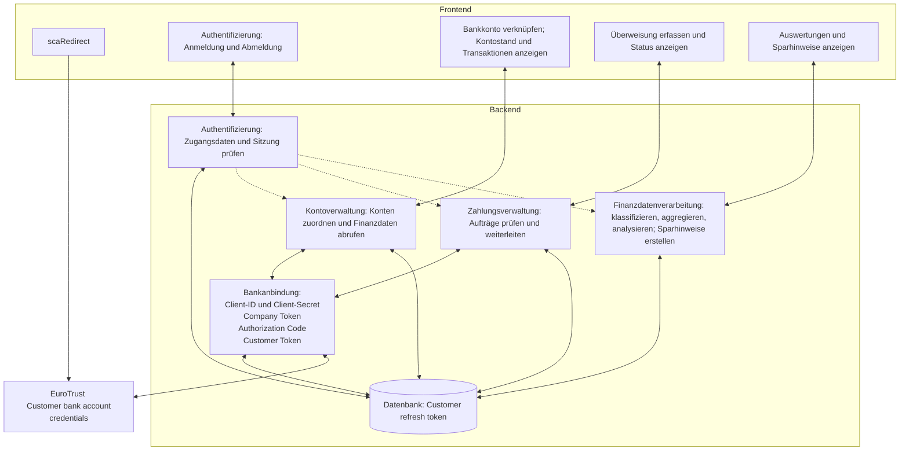

# 3.1.1 Security View – Credentials EuroTrust

```mermaid
flowchart TB
    subgraph FE["Frontend"]
        FscaRedirect["scaRedirect"]
        FAuth["Authentifizierung: Anmeldung und Abmeldung"]
        FAccount["Bankkonto verknüpfen; Kontostand und Transaktionen anzeigen"]
        FPayment["Überweisung erfassen und Status anzeigen"]
        FAnalysis["Auswertungen und Sparhinweise anzeigen"]
    end

    subgraph BE["Backend"]
        BAuth["Authentifizierung: Zugangsdaten und Sitzung prüfen"]
        BAccount["Kontoverwaltung: Konten zuordnen und Finanzdaten abrufen"]
        BPayment["Zahlungsverwaltung: Aufträge prüfen und weiterleiten"]
        BAnalysis["Finanzdatenverarbeitung: klassifizieren, aggregieren, analysieren; Sparhinweise erstellen"]
        BBank["Bankanbindung: \n Client-ID und Client-Secret \n Company Token \n Authorization Code \n Customer Token"]
        DB[("Datenbank: Customer refresh token")]
    end

    Bank["EuroTrust \n Customer bank account credentials"]

    FAuth <--> BAuth
    FAccount <--> BAccount
    FPayment <--> BPayment
    FAnalysis <--> BAnalysis
    BAuth <--> DB
    BAuth -.-> BAccount
    BAuth -.-> BPayment
    BAuth -.-> BAnalysis
    BAccount <--> BBank
    BPayment <--> BBank
    BAccount <--> DB
    BPayment <--> DB
    BAnalysis <--> DB
    BBank <--> DB
    BBank <--> Bank
    FscaRedirect --> Bank
```

